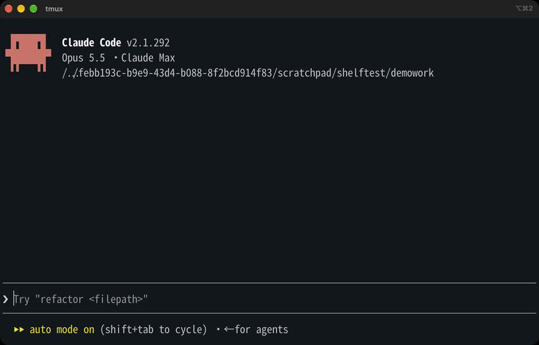

# image-shelf

**繁體中文** | [English](#english)



Claude Code 的 mod（外掛）。貼上的圖片會排在輸入框左上方，顯示成真正的縮圖；點一下就能畫圈、加箭頭、寫字、裁切，Claude 收到的是標註過的版本。

在終端機裡，貼上的圖片只會顯示成 `[Image #3]`，貼了幾張之後就分不清哪張是哪張。Claude Code 內建的圖片元件只在 Ghostty、kitty 這類終端機畫得出來，**iTerm2 和 tmux 裡看不到**。image-shelf 在那種環境改用一個浮在終端機上方的透明小視窗來顯示圖片，像桌寵一樣。

## 安裝

在 Claude Code 的輸入框打：

```
/plugin install image-shelf --marketplace olilllioli287/claude-code-image-shelf
```

問要不要加入來源時按 `y`，範圍選 user。第一次貼圖會花幾秒編譯浮動視窗和編輯器。

## 移除與重裝

```
/plugin uninstall image-shelf@image-shelf
```

想連來源一起移除：`/plugin marketplace remove image-shelf`。之後要再裝，照上面的安裝指令再打一次就好，可以重複。

不會留下東西在你的設定裡：編譯出來的程式放在 `/private/tmp/image-shelf/`（重開機會自動清掉）；只有你自己建立了 `~/.config/image-shelf.json` 才需要手動刪。

## 需求

- macOS，Xcode Command Line Tools（`xcode-select --install`），用來編譯浮動視窗
- Claude Code 2.1.292 以後（mod 是搶先體驗功能）
- iTerm2：有沒有 tmux 都可以。iTerm2 要有「螢幕錄製」權限（用來量視窗裡的列從哪裡開始）
- Ghostty / kitty（不在 tmux 裡）：直接用 Claude Code 內建的圖片元件，不需要浮動視窗

## 用法

- 貼圖（Ctrl+V）：不跳視窗，圖片出現在輸入框上方
- 圖片超過一排：觸控板左右滑，或按住 Shift 滾滾輪
- 點圖片：打開標註編輯器（P 畫筆、O 圓、B 框、A 箭頭、T 文字、C 裁切、R 旋轉、Enter 完成、Esc 取消）
- 編輯過的圖會加上橘框和「已編輯」；送出時 Claude 會被告知去讀編輯版（原圖仍會附上，mod 無法替換已貼上的圖）

## 運作方式

- mod 在輸入框上方留出空白列；浮動視窗（`panel/shelf.swift`）把圖片蓋在那些列上
- 位置：iTerm2（AppleScript）給視窗位置，tmux 給窗格位置與字格大小，再從 tmux 畫面文字找出輸入框上方的白線和 Claude Code 的 `[-]`；列從視窗頂端開始的位移，用截一條細長畫面、找兩條白線量出來
- `[-]`（收合按鈕）用一塊終端機背景色的小視窗蓋住，滑鼠可穿透
- 切到別的 App、切 tmux 分頁、Claude 正在回答時自動隱藏；tmux 版面變動用 tmux control mode 監聽

## 微調

`~/.config/image-shelf.json`：

```json
{ "dx": 0, "dy": -5.5 }
```

`dy` 是圖片相對白線的上下位移（點，負數往上）。預設值是在 Noto Sans Mono CJK TC 20、行高 0.96 下調的，字型不同可能要微調。

## 已知限制

- 只在 macOS + iTerm2（+ tmux）+ Ghostty 測過；Terminal.app、WezTerm 等未測
- 浮動視窗跟著視窗移動會慢一點（放開滑鼠才對齊）
- 用鍵盤切 iTerm2 分頁時，最多 20 秒才隱藏
- 依賴 Claude Code 存貼上圖片的暫存資料夾位置（內部結構，不是公開 API）

## 致謝

標註編輯器（`editor/`）取自 [alan890104/claude-code-paste-preview](https://github.com/alan890104/claude-code-paste-preview)（MIT），未修改。

## 授權

MIT

---

## English

A Claude Code mod that shows the images you paste as real thumbnails above the prompt, on the left, and lets you mark one up with a click.

Claude Code's own `Image` element draws only in terminals with the kitty graphics protocol (Ghostty, kitty), and never through tmux. image-shelf draws there when it can, and in iTerm2 (with or without tmux) it floats a transparent borderless window over blank rows it reserves above the prompt.

**Install** (in Claude Code): `/plugin install image-shelf --marketplace olilllioli287/claude-code-image-shelf`

**Needs**: macOS, Xcode Command Line Tools, iTerm2 with Screen Recording permission (to measure where rows start), or Ghostty/kitty outside tmux.

**Use**: paste as usual (no popup); swipe or Shift+wheel to scroll a long row; click a picture to annotate it (pen, ellipse, box, arrow, text, crop, rotate). An edited picture gets an orange border; on send, Claude is told to read the edited file.

**Uninstall**: `/plugin uninstall image-shelf@image-shelf` (and `/plugin marketplace remove image-shelf`); reinstall with the install line above.

**Tuning**: `~/.config/image-shelf.json` → `{ "dx": 0, "dy": -5.5 }` (points; negative moves up).

The markup editor (`editor/`) is from [alan890104/claude-code-paste-preview](https://github.com/alan890104/claude-code-paste-preview) (MIT), unmodified.
